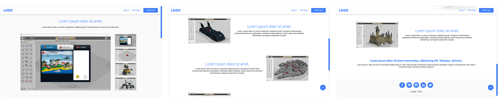

# Web - Flip Book

## 🔖 Table of contents

<details>
        <summary>
		CLICK TO ENLARGE 😇
        </summary>
	    📝 <a href="#description">Description</a>
        <br>
        🔨 <a href="#tech-stack">Tech stack</a>
        <br>
        📂 <a href="#files-description">Files description</a>
        <br>
        💻 <a href="#installation">Installation</a>
        <br>
        🔧 <a href="#whats-next">What's next ?</a>
        <br>
        ♥️ <a href="#thanks">Thanks</a>
        <br>
        👷 <a href="#authors">Authors</a>
</details>

## 📝 <span id="description">Description</span>

This project started with an idea from <a href="https://github.com/Eonvorax">Eonvorax</a>, a peer from Holberton School. He wanted a simple way to create a landing page without using complicated templates. We worked together to design a basic and user-friendly page for one of his projects, focusing on what's most important.
<br><br>
I took that idea and created a minimalist landing page template. It's built with just HTML, CSS, and a touch of JavaScript, making it straightforward to modify and customize. The design is responsive and looks great on any device. You can easily adjust elements like colors, logo, titles, and text to fit your needs.
<br><br>
Feel free to use this template however you like. Despite being a learner, I think the code is clean and well-organized, making it easy to make changes or add new features in the future.

## 🔨 <span id="tech-stack">Tech stack</span>

<p align="left">
    
    
    
<p>

## 📂 <span id="files-description">Files description</span>

| FILE               | DESCRIPTION                                                   |
| :----------------: | ------------------------------------------------------------- |
| `resources`        | Contains the fonts and images required for the landing page.   |
| `README.md`        | The readme file you are currently reading ;).                 |
| `behavior.js`      | JavaScript code for dynamic page interactions and animations. |
| `index.html`       | Main HTML file for the landing page.                          |
| `style.css`        | CSS stylesheet for the landing page layout.                   |

## 💻 <span id="installation">Installation</span>

1. Clone this repository:
    - Open your preferred Terminal.
    - Navigate to the directory where you want to clone the repository.
    - Run the following command:
```
git clone https://github.com/fchavonet/web-basic_landing_page_template.git
```

2. Open the folder in your favorite IDE.

To see the template in action, visit <a href="https://fchavonet.github.io/web-basic_landing_page_template/">the basic landing page template online</a>.

<p align="center">

</p>

## 🔧 <span id="whats-next">What's next ?</span>

- Add the basic tags needed for SEO.

## ♥️ <span id="thanks">Thanks</span>

A big thank you to my friend Pierre and Yoann for taking time out of his busy schedule to test this little page.

## 👷 <span id="authors">Authors</span>

**Fabien CHAVONET**
- Github: [@fchavonet](https://github.com/fchavonet)